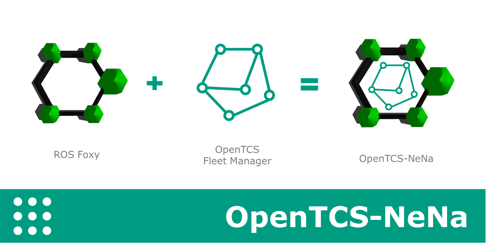
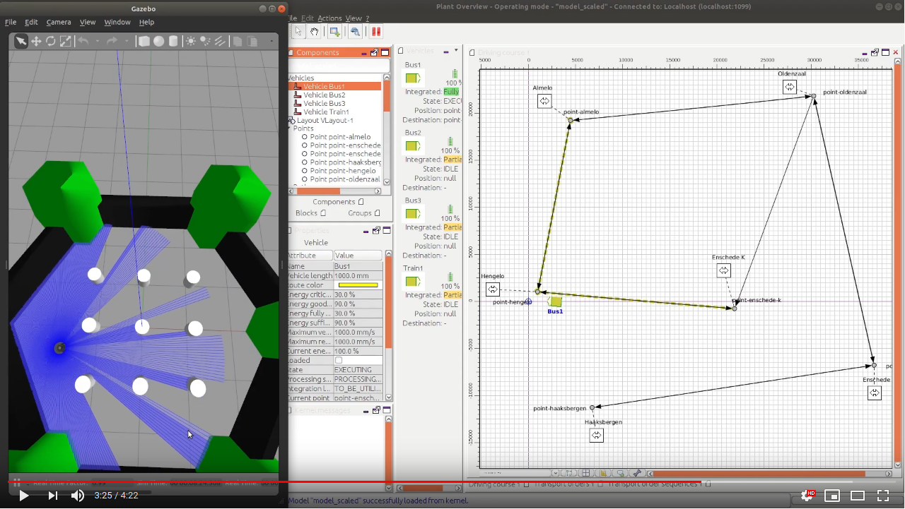

OpenTCS and ROS2 are both open-source software packages. OpenTCS can be used as a fleet manager to autonomously manage self-driving vehicles. ROS2 is a widely used software package that takes care of common functionality that many AGVs share, such as support for sensors, cameras and SLAM.

The OpenTCS-NeNa software is an OpenTCS vehicle driver that fits the link between ROS2 robots and the OpenTCS Fleet Manager. The initial development of this vehicle driver was part of my Bachelor Thesis at Saxion University, and is part of project NeNa. Ever since, I continued developing this software to what is today.

- [RELEASE 1.1](https://github.com/nielstiben/openTCS-NeNa/tree/RELEASE1.1) is compatible with OpenTCS 4.17 and ROS 2 Dashing.
- [RELEASE 2.0](https://github.com/nielstiben/openTCS-NeNa/tree/RELEASE2.0) is compatible with OpenTCS 5.0 and ROS 2 Foxy.

The following software and software libraries are used for developing the driver:

* ROS 2 - Foxy
* [IHMC Java ROS 2 Communication](https://github.com/ihmcrobotics/ihmc-java-ros2-communication)
* [OpenTCS 5.0](https://www.opentcs.org/en/index.html)

## Demo Video:

## Features:
All the native OpenTCS features are implemented in this driver, which means that the driver is ready to be used. Note that, if you want to use vehicle specific actions (e.g. a turning light)to you need to manually implement into this software (see Developer Guide).

_General features:_

Fully supported OpenTCS Transport Orders.
* Fully supported OpenTCS Operations.
* Properly handle ROS2 AGV navigation failures, such an unreachable destination.
* Live position tracking of a ROS2 AGV for showing in the OpenTCS Plant Overview.
* Live orientation of the ROS2 AGV for showing in the OpenTCS Plant Overview.
* Configurable ROS2 namespaces, which allows usage for multiple ROS2 AGVs simultaneously.
* Configurable ROS2 domain IDs.
* Plant Model scaling, allowing better representation for tiny/huge plant maps. 

_Control panel features:_

* Dispatch the ROS2 AGV to a user-defined coordinate.
* Dispatch the ROS2 AGV to an OpenTCS Plant Model point.
* Set the initial position of a ROS2 AGV.
* Show a continuously updated ROS2 navigation status in the control center panel.
* Show the connection status in the control center panel.

## Getting Started
**NOTE:** *The OpenTCS-ROS2 driver has only been tested on Ubuntu 20.04 in combination with the [Turtlebot 3](http://emanual.robotis.com/docs/en/platform/turtlebot3/ros2_setup/)* with ROS Foxy in the  Gazebo simolation environment.

__Prerequisites:__

1. Install ROS2 Foxy, see instructions [here](https://index.ros.org/doc/ros2/Installation/Foxy/Linux-Install-Debians/). `unzip -d ~/ ~/openTCS-NeNa/build/distributions/openTCS-NeNa-<version>-bin.zip`
2. Install the Turtlebot 3 environment for ROS2 Foxy, see instructions [here](https://emanual.robotis.com/docs/en/platform/turtlebot3/quick-start/#pc-setup). Make sure you follow the instructions for ROS 2 Foxy by selecting the right tab.
3. The software is tested with Gradle v6.8.1 in correspondence to OpenTCS 5.0. If you experience issues with older or newer Gradle editions, please install Gradle 6.x. You can check your current Gradle version using a linux command: `gradle -v`. Gradle v6.8.1 can be downloaded on the [Gradle Releases](https://gradle.org/releases/) page.
4. it is *mandatory* to have JDK 13 installed. The current version of OpenTCS uses JDK 13, and therefore is OpenTCS-NeNa also uses JDK 13. Oracle JDK and OpenJDK both work. Make sure that *both* you Java executor (`java`) and Java compiler (`javac`) are set to JDK 13.
    * Check your Java executor with (`java -version`) and Java compiler (`javac -version`). Both should return version 13.
    * If you have a different Java version, you should install JDK 13 and set the default Java version ([here](instructions https://askubuntu.com/questions/121654/how-to-set-default-java-version)).

__Install:__

1. Download the OpenTCS-NeNa RELEASE 2.0 binary at the [releases page](https://github.com/nielstiben/openTCS-NeNa/releases).
2. Extract the binary to a location of choice: `unzip -d ~/ ./openTCS-NeNa-5.0.0-RELEASE_2.0-bin.zip`

__Run Example Plant (as shown in the demo video):__

1.  Start the OpenTCS Kernel
    * Open new terminal: `CTRL + ALT + T`
    * Change working directory to the OpenTCS Kernel: `cd ~/openTCS-NeNa-5.0.0-RELEASE_2.0-bin/openTCS-NeNa-Kernel`.
    * Start kernel: `sh startKernel.sh`
2.  Start the OpenTCS Plant Overview:
    * Open new terminal: `CTRL + ALT + T`
    * Change working directory to OpenTCS Plant Overview: `cd ~/openTCS-NeNa-5.0.0-RELEASE_2.0-bin/openTCS-NeNa-PlantOverview/`.
    * Start PlantOverview: `sh startPlantOverview.sh`
3.  In the Plant Overview, load the Turtlebot3 Example Project
    * `File`-> `Load Model...` (CTRL + L).
    *  Look for the following file that is included in the code source base: `openTCS-NeNa-Documentation/src/docs/turtlebot3_world_example_plant/example_model_scaled.xml`. If you found it, open it!
4.  Persist the loaded model to the OpenTCS Kernel: `File`-> `Persist model in the kernel` (ALT + P).
5.  Switch the Plant Overview to ‘operating mode’: `File`-> `Mode`-> `Operating mode` (ALT + O).
6.  Start the OpenTCS Kernel Control Center. Don't close the Kernel and Plant Overview!
    * Open new terminal (`CTRL + ALT + T`)
    * Change working directory to OpenTCS Kernel Control Center: `cd ~/openTCS-NeNa-5.0.0-RELEASE_2.0-bin/openTCS-NeNa-KernelControlCenter/`.
    * Start kernel: `sh startKernelControlCenter.sh`
7.  On the upper tab, select `Vehicle Driver`
8.  Double click on the first vehicle in the list (‘Bus1’) and open the ‘ROS2 Options’ panel.
9.  Enable the driver. You can specify a custom namespace if you have multiple ROS2 robot instances. If you only have one robot, you can leave it empty. The default domain ID for ROS2 Foxy is 30, if you are unsure what this means then you should leave it on 30.
10. Set the initial position of the Turtlebot by clicking on `Set Initial Point`. Select `point-hengelo`, which is the closest point to Turtleot's default starting point. This step can be skipped if you have already set the initial point in RViz.
11.  The AGV is now ready to be used. You can test it by pushing the
     ‘Dispatch to coordinate’ button.

What to do next? You can now, for instance, [create a transport order](https://www.opentcs.org/docs/4.17/user/opentcs-users-guide.html#_creating_a_transport_order).

## Developer Guide
The Developer Guide is written for persons who would like to continue working on this software, or for those who are just curious. It describes the architecture, development paradigms and elaborations about decisions.
Here's [documentation about the development of the ROS 2 Driver](openTCS-NeNa-Documentation/src/docs/developers_guide/developers_guide.pdf) ( [pdf](openTCS-NeNa-Documentation/src/docs/developers_guide/developers_guide.pdf) | [odt](openTCS-NeNa-Documentation/src/docs/developers_guide/developers_guide.odt) ).

## Changelog
New in RELEASE 2.0:

* Support for ROS 2 Foxy.
* Updated to OpenTCS 5.0, which is using Java 13 now (yay!)
* New library for communication: ['IHMC Java ROS 2 Communication'](https://github.com/ihmcrobotics/ihmc-java-ros2-communication). Previously, RCLJava was used but this is no longer compatible with ROS 2 Foxy. Please see the Developer Guide for full elaboration on this.
* Support for Domain IDs.
* Simplified installation steps.
* Refresh the Control Center GUI panel and place reference to this GitHub repository.
